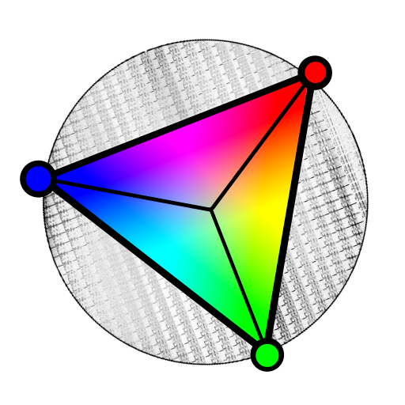
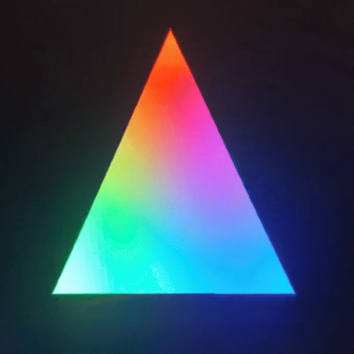
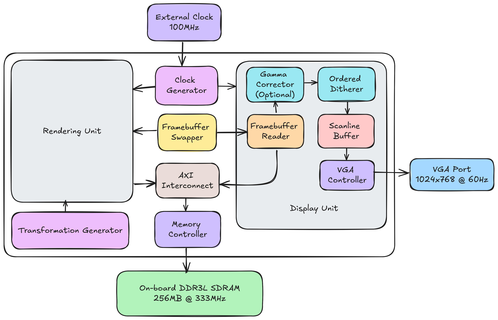
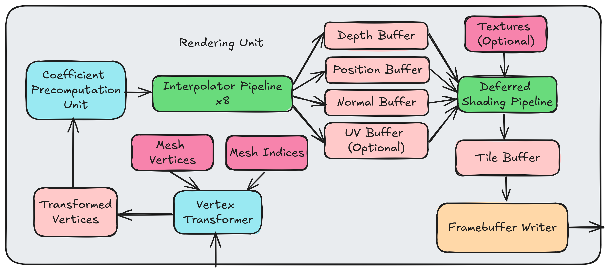

# Raster I
[](https://opensource.org/license/mit)

Raster I is a hardware renderer that specializes in real-time rasterization and is based on the [Tile-Based Deferred Rendering (TBDR)](https://en.wikipedia.org/wiki/Tiled_rendering) architecture. Currently, several crucial features are implemented along with a tiled [Pineda](https://www.cs.drexel.edu/~deb39/Classes/Papers/comp175-06-pineda.pdf) style rasterizer, including hardware-accelerated transform and lighting (T&L), deferred Phong shading, double buffering, VSync, MSAA anti-aliasing, ordered dithering and back-face culling. Its implementation is divided into two parts, one is written in [Chisel HDL](https://www.chisel-lang.org/), and the other is based on [Xilinx Vitis HLS](https://www.amd.com/en/products/software/adaptive-socs-and-fpgas/vitis/vitis-hls.html). 

Furthermore, Raster I consists of a multi-cycle vertex transformer, 8 parallel interpolator pipelines, and a deferred shading pipeline that employs the Phong shading model (internal calculations use Q11.13 fixed point numbers). The output VGA signal can be configured up to 1024x768 @ 60Hz, and tiles of size 64x32 are rendered sequentially. Visual enhancements are also supported with minimal overhead, such as ordered dithering for displaying pseudo 24bpp pixels and MSAA 4x anti-aliasing. If there is enough BRAM left over for texture storage, an optional texture sampling unit is also available.

As a result, this GPU utilizes 69% LUT, 97% BRAM, and 88% DSP from [Digilent Arty A7-100T](https://digilent.com/shop/arty-a7-100t-artix-7-fpga-development-board/) and can render a 3D model with 3K faces at a screen resolution of 1024x768 and a clock frequency of 100MHz at about 30FPS. It is also worth mentioning that this is only the first iteration of Project Raster, with key features like GPGPU ISA yet to be implemented. Therefore, in future releases, it will eventually evolve into a fully-fledged open-source hardware that supports practically all of the typical features of modern GPUs.

|||
|-----------------------------------------------|-----------------------------------------------|
|||

## Architecture



The architecture of Raster I can be mainly viewed as 3 separate clock domains: system, graphics and display (their frequencies are currently 100MHz, 100MHz and 65MHz). While the components in the graphics clock domain is for traditional rendering tasks, the display clock domain is in charge of reading the framebuffer from DRAM, applying effects like dithering and presenting it onto the screen synchronously.

At the heart of the system is a framebuffer swapper, which acts as a coordinator between two clock domains. When a new frame is drawn while the VGA controller is in its [vertical blanking interval](https://en.wikipedia.org/wiki/Vertical_blanking_interval), it swaps the framebuffers that they write to or read from, achieving the effect of VSync. Additionally, there is also an instance of AXI interconnect connected to the memory controller. It arbitrates requests from from two clock domains, making the memory a dual-ported RAM.

### Rendering Unit


Before delving into the architecture of the rendering unit, here's a quick overview of tiled rendering: the entire screen is divided into multiple tiles, and the renderer processes them sequentially, generating the final result of each pixel inside one tile before moving on to the next, rather than drawing all primitives directly to the framebuffer. This solution has the advantage of just writing the whole framebuffer once for each frame, which reduces the complexity of memory access patterns, at the cost of creating several buffers for temporary storage.

The dataflow of the rendering unit is divided into three stages: vertex transformation, pixel interpolation, and deferred shading. Stages with a significant impact on performance are pipelined. As previously stated, because this GPU is based on a tiled architecture, various temporary buffers are created, including transformed vertices, [G-buffers](https://en.wikipedia.org/wiki/Glossary_of_computer_graphics#g-buffer), and a tile buffer (the framebuffer of tiles). Furthermore, those primitivives that are not visible from a given tile, either outside of the bounding box or back-facing, are culled in advance to save wasteful rendering.

When a new frame begins, the rendering unit reads the rotation angle of the frame from the transformation generator and updates the mesh vertices accordingly. The coefficients of the edge function of the primitive to be rendered are then pre-computed to reduce the number of multiplications (a trick presented in [Pineda's paper](https://www.cs.drexel.edu/~deb39/Classes/Papers/comp175-06-pineda.pdf)). After calculating all of the relevant constants, 8 interpolator pipelines take 4 samples to evaluate visibility (thus MSAA 4x is implemented with nearly no overhead) and interpolate vertex data (stored in G-buffers) for each pixel in parallel. Finally, the deferred shading pipeline computes the lighting for each pixel based on the interpolated data and flushes the tile buffer.

### Display Unit
The display unit operates in sync with the output VGA signal and issues AXI read requests to the VRAM controller upon reaching the [horizontal blanking interval](https://en.wikipedia.org/wiki/Horizontal_blanking_interval). Each pixel of a scanline is then loaded and processed in advance, making it available for display in the scanline buffer when the VGA signal timing arrives. This strategy exempts the renderer from the duty of "racing the beam" and enables it to run at the desired speed, as long as the framebuffer serves as the synchronizer for the two different timings.

Moreover, two optional post-processing effects are also applied in the display unit: ordered dithering uses a threshold matrix, known as bayer matrix, to approximate RGB888 pixel colors in the RGB444 format, which is the limitation of the VGA adaptor I'm using, and [gamma correction](https://en.wikipedia.org/wiki/Gamma_correction) normalizes the result when the internal lighting calculations are performed in the linear [sRGB](https://en.wikipedia.org/wiki/SRGB) color space.

## Build Instructions
To build Raster I, three components must be compiled successively: Chisel HDL modules, the HLS graphics pipeline, and finally the entire system. All of the Chisel HDL source code is in `system/src/main/scala`. Therefore, you must first navigate to the `system` directory and execute the following command.

```shell
sbt run
```

After Scala has completed its execution, a SystemVerilog file will be available under `system/generated`, defining the structure of the entire system as well as some critical modules. Then, launch Vitis IDE and select the directory containing this project as your workspace. The index contains an HLS component that serves as the main graphics pipeline and renderer. To produce HDL files from HLS source code, click **Synthesis** followed by **Package**.

Now launch Vivado from `system/vivado` and execute `build.tcl` (**Tools** -> **Run Tcl Script**). If completed successfully, the project will be initialized with all source files included and Arty A7-100T selected as the FPGA board (the board package must be installed first). It is important to note that the IP version of the HLS kernel specified in the Vivado project must be upgraded. This can be accomplished by refreshing the **IP Catalog** and pressing **Upgrade Selected** in **IP Status**.

After clicking **Generate Bitstream**, it will take several minutes (depending on the speed of your computer) to build the FPGA bitstream. If no errors are generated, you can now launch the hardware manager and program the device.